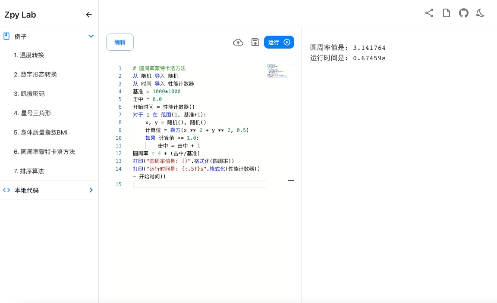

# Zpy Lab

中文Python编程Lab

## 介绍

- 中文编程
- 在线运行
- 与Python语法相同

中文Python编程Lab，[在线尝试 - Zpy Lab](http://zpy-lab.rocke.top)

<div align="center">
     
</div>

## 本地运行

如果你想下载到本地运行，请先确保本地安装有Python3环境

### 1.下载zpy-ide库

``` shell
# 从GitHub下载
git clone https://github.com/louisyoungx/zpy-lab.git
# 从Gitee下载
git clone https://gitee.com/louisyoungx/zpy-ide.git
```

### 2.进入文件夹，安装依赖

``` shell
# 进入文件夹
cd zpy-ide
# 安装依赖Flask
yarn install
```

### 3.启动 Zpy Lab

``` shell
yarn start
```

### 4.编译输出到build/目录
```shell
yarn build
```

## 感谢

- HedgeHog Lab
- React
- TypeScript
- Monaco Editor

本项目部分包含 [Hedgehog Lab](https://github.com/Hedgehog-Computing/hedgehog-lab) 中的代码 (Apache 2.0协议)